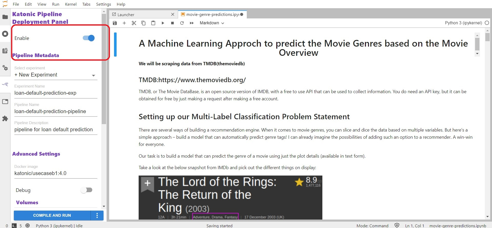
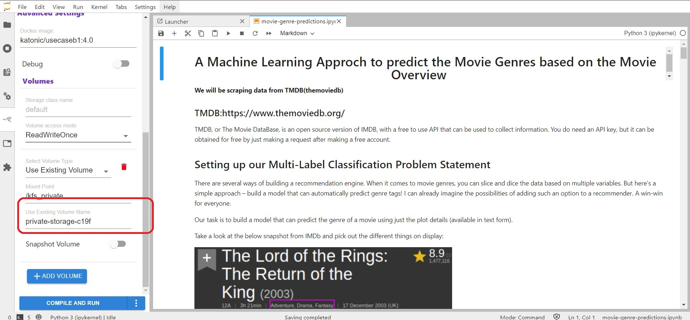
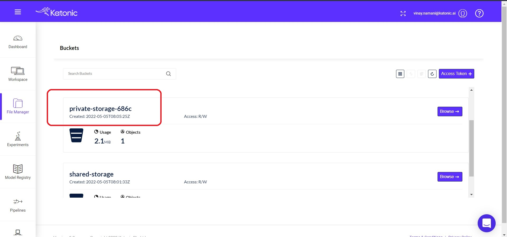

# Movie Genre Prediction

A multi-label classification probelm using Machine learning which will help you predicting the Genres of the given movies based on the Movie Overview.

# Problem Overview

Movie Overview contain a lot of information about movie. Such information can be valuable in building automatic systems to create genres for movies.

Automatic tagging systems can help recommendation engines to improve the retrieval of similar movies as well as help viewers to know what to expect from a movie in advance.

We will try to make genre tag prediction using Movie Overviews.

# Brief Introduction to Multi-Label classification

We're as excited as you are to jump into the code and start building our genre classification model. Before we do that, however, let me introduce you to the concept of multi-label classification in NLP. It’s important to first understand the technique before diving into the implementation.

The underlying concept is apparent in the name – multi-label classification. Here, an instance/record can have multiple labels and the number of labels per instance is not fixed.

Let me explain this using a simple example. Take a look at the below tables, where ‘X’ represents the input variables and ‘y’ represents the target variables (which we are predicting):

* ‘y’ is a binary target variable in Table 1. Hence, there are only two labels – t1 and t2
* ‘y’ contains more than two labels in Table 2. But, notice how there is only one label for every input in both these tables
 *You must have guessed why Table 3 stands out. We have multiple tags here, not just across the table, but for individual inputs as well

We cannot apply traditional classification algorithms directly on this kind of dataset. Why? Because these algorithms expect a single label for every input, when instead we have multiple labels. It’s an intriguing challenge and one that we will solve in this usecase.

# How to run the Pipeline Notebook.

* Click on Katonic Pipeline Deployment Panel from the Left sidebar and Enable it.

* Here you are able to edit all the pre-defined settings and configurations, but in order to run the Pipeline inside your workspace, you need to change one parameter `Use Existing Volume Name` with your Private storage ID which you can find inside the File-Manager.

* You can find the Private storage ID from the File-Manager.

After replacing the existing volume id with your private storage ID. Then click on the Compile and Run option from below. 

You can see that the pipeline is in running mode.

# How to run the App.

* Clone this repository to your local system or any other project workspace.
* Then create a repository in your Personal profile inside the GitHub.
* Copy the files the are available inside this app folder [app folder link](https://github.com/katonic-dev/Katonic-ML-Marketplace/tree/master/Movie_Genre_Prediction_App/app) to your repository.

Once you have all the Application files into your Personal repository, Follow this [documentaion](https://docs.katonic.ai/Getting-started-with-featured-store/app_deployment) to deploy an application.
